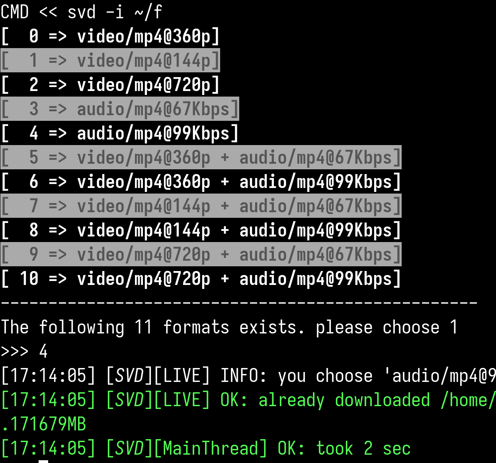

# simple video downloader(svd)
### A simple downloader for common video urls passed as json.


### It can download:
1. Raw videos e.g example.com/video.mp4
2. Segmented videos (hls)
3. Specific live videos (from facebook and Instagram)
4. Specific Dash xml videos

### Notes
1. simple json should include url,headers & type e.g
    ```json
    {
        "url":"example.com/video.mp4",
        "headers":
                    {"referer":"example.com"},
    }
    ```

2. Since creating this json could be tedious, a simple svd browser extension
    is provided [here](https://github.com/fskamau/svd-extension)

## Dependencies
This package depends on ffmpeg and xsel (for pasting from clipboard)

## Installation
1. Clone the necessary repos and install svg package
```bash 
git clone https://github.com/fskamau/svd.git svd 
git clone https://github.com/fskamau/svd-extension.git svd-extension
cd svd
pip install .
```

2. Load svd extension in a browser
#### In Firefox 
- Open a browser and navigate to about:debugging.
- Then select 'This Firefox', then 'Load Temporary Add-on...'
- A file dialog will appear, navigate to svd-extension folder and load click ok.
- Please note that the extension will have to be reloaded everytime the browser is started

3. Use it!
- Navigate to desired site of your choice and wait for a video to load.
- Click on the extension and copy the url.
- Run svd and simply download the video.
 ```bash
svd
```


                    
